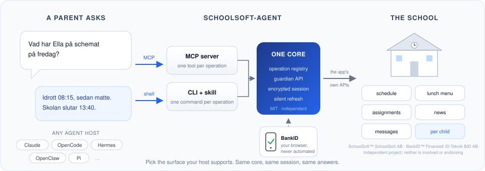

# schoolsoft-agent

[](https://github.com/grimen/schoolsoft-agent/actions/workflows/ci.yml?query=branch%3Amain)
[](https://github.com/grimen/schoolsoft-agent/actions/workflows/ci.yml?query=branch%3Amain)
[](https://github.com/grimen/schoolsoft-agent/actions/workflows/ci.yml?query=branch%3Amain)
[](https://www.npmjs.com/package/schoolsoft-agent)
[](LICENSE)



[SchoolSoft](https://www.schoolsoft.se) for AI agents. Lets an agent (Claude, OpenCode, OpenClaw, Hermes, Pi, …) read a guardian's SchoolSoft data: schedule, lunch menu, assignments, news and the message inbox. Login is [BankID](https://www.bankid.com) in your own browser; nothing is automated around it, and the session is stored encrypted on your machine.

Two surfaces, one core. Pick the one your host supports or you prefer:

| Surface                               | What it is                                                                          | Best for                                                              |
| ------------------------------------- | ----------------------------------------------------------------------------------- | --------------------------------------------------------------------- |
| **MCP server** `schoolsoft-agent-mcp` | A stdio MCP server exposing one tool per operation                                  | Claude Code, Claude Desktop, OpenCode, OpenClaw, Hermes, any MCP host |
| **CLI + skill** `schoolsoft-agent`    | A JSON-emitting CLI wrapped by an [Agent Skills](https://agentskills.io) `SKILL.md` | Hosts without MCP (Pi), shell-first agents, scripting                 |

Both are the same npm package and behave identically, because every capability is defined once as an _operation_ and both surfaces are generated from that list. See [docs/architecture.md](docs/architecture.md).

> **Independent project.** [SchoolSoft](https://www.schoolsoft.se) is a trademark of SchoolSoft AB. This is an independent, MIT-licensed community project: it is not affiliated with, endorsed by, or supported by SchoolSoft AB, and SchoolSoft has no involvement in it. It talks to SchoolSoft through the same unofficial APIs the SchoolSoft app uses; read [Trademark and independence](#trademark-and-independence) and [Privacy](#privacy) before installing.

## 60-second install

Prerequisite: Node 22 or newer.

```bash
npx -y schoolsoft-agent configure --query "Rösjöskolan"   # finds your school's slug
npx -y schoolsoft-agent login                              # BankID in your browser
npx -y schoolsoft-agent get-schedule --pretty
```

Then register with your host:

| Host           | How                                                                                                                                                                                      |
| -------------- | ---------------------------------------------------------------------------------------------------------------------------------------------------------------------------------------- |
| Claude Code    | `/plugin marketplace add grimen/schoolsoft-agent` then `/plugin install schoolsoft-mcp@schoolsoft-agent` **or** `schoolsoft-skill@schoolsoft-agent` — [guide](docs/hosts/claude-code.md) |
| Claude Desktop | Install the `.mcpb` bundle from the latest release — [guide](docs/hosts/claude-desktop.md)                                                                                               |
| OpenCode       | MCP snippet for `opencode.json`, or copy the skill — [guide](docs/hosts/opencode.md)                                                                                                     |
| OpenClaw       | `clawhub` skill or native MCP — [guide](docs/hosts/openclaw.md)                                                                                                                          |
| Hermes Agent   | `hermes skills install github:grimen/schoolsoft-agent/skills/schoolsoft` — [guide](docs/hosts/hermes.md)                                                                                 |
| Pi             | `pi install git:github.com/grimen/schoolsoft-agent` (skill only) — [guide](docs/hosts/pi.md)                                                                                             |

Every crucial command is also a `make` target; run `make help` in a checkout.

## What you can ask

- "Vad har Ella på schemat på fredag?"
- "Vad är det till lunch i veckan?"
- "Har vi fått några meddelanden från skolan?"
- "Vilka läxor finns den här veckan?"

The agent picks the child (`list_children`), the week, and the right operation. Contact lists, subject rooms, bookings and shared files have no API at SchoolSoft; those four read through an optional headless browser (`npx -y schoolsoft-agent browser install`, once). Full reference: [MCP tools](docs/reference/tools.md) · [CLI commands](docs/reference/commands.md).

## How login works

1. The agent calls `login`. Your browser opens SchoolSoft's real login page for guardians.
2. You authenticate with BankID (or whatever your municipality offers). The integration never sees credentials.
3. SchoolSoft redirects to `http://127.0.0.1:43117/callback` with a one-time code; the integration exchanges it for tokens and session cookies.
4. Tokens are stored encrypted (AES-256-GCM, key file `0600`) and refreshed silently. You log in again only when the refresh token expires.

Details and diagrams: [docs/architecture.md](docs/architecture.md). What SchoolSoft actually exposes: [docs/schoolsoft-api.md](docs/schoolsoft-api.md).

## Privacy

- Your children's data is only ever sent to SchoolSoft and to the AI model you are talking to, in the conversation you started. No telemetry, no third party.
- The only thing stored on disk is the encrypted session (tokens, cookies, the list of your children with names and class) under your platform's config directory (`schoolsoft-agent doctor` shows where). `schoolsoft-agent logout` deletes it.
- Nothing is written to log files. Diagnostics on stderr never include personal data.
- This is unofficial automated access. Check SchoolSoft's terms of service for your municipality before relying on it.

## Development

```bash
git clone https://github.com/grimen/schoolsoft-agent && cd schoolsoft-agent
make setup          # node check + npm ci + git hooks
make check          # lint, typecheck, format, boundaries, manifests, tests with coverage
make e2e-artifact   # shipped-artifact + host E2E in a sandbox (what CI runs)
make e2e            # live suite against SchoolSoft (needs configure + one login)
make help           # everything else
```

Layout, boundaries and the test pyramid are in [docs/architecture.md](docs/architecture.md); conventions, hooks and the CI stages in [CONTRIBUTING.md](CONTRIBUTING.md); how versions ship in [docs/releasing.md](docs/releasing.md). Adding an operation touches one file under `src/core/operations/` plus the registry; both surfaces and the docs follow.

## Roadmap

- Write operations: report absence, send message (separate spec; confirmation-gated).
- Remote transport (streamable HTTP with per-user storage) so ChatGPT and hosted agents can use it.
- Claude Desktop extension directory listing.

## Trademark and independence

SchoolSoft is a trademark of SchoolSoft AB. This is an independent, MIT-licensed community project: it is not affiliated with, endorsed by, or supported by SchoolSoft AB, and SchoolSoft has no involvement in it. The name is used only to describe what the software connects to. [BankID](https://www.bankid.com) is a trademark of Finansiell ID-Teknik BID AB; Claude, OpenCode, OpenClaw, Hermes and Pi are trademarks of their respective owners. All are named descriptively, and none of these organisations is involved in or endorses this project. No logos or brand assets are used. If any rights holder objects to a use of their name, open an issue and it will be addressed.

## License

MIT © Jonas Grimfelt. Runtime dependency on [elias4044/ssp-node](https://github.com/elias4044/ssp-node) (MIT) for HTTP helpers. The unofficial API knowledge and its sources are documented in [docs/schoolsoft-api.md](docs/schoolsoft-api.md).
