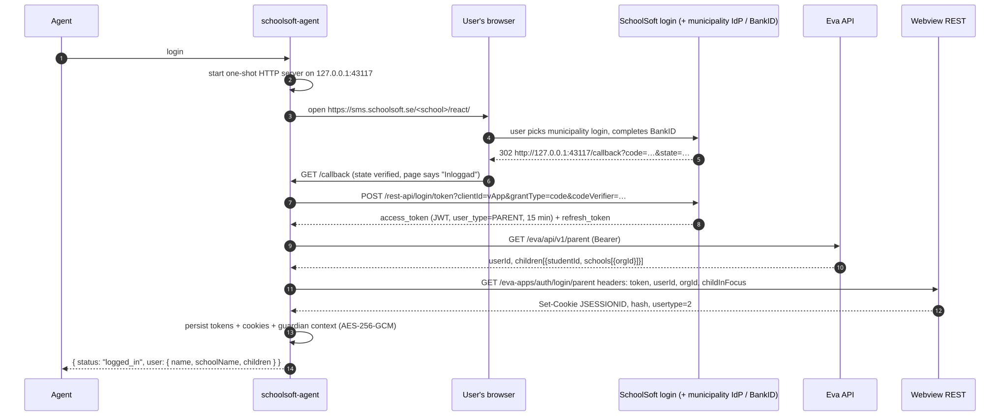
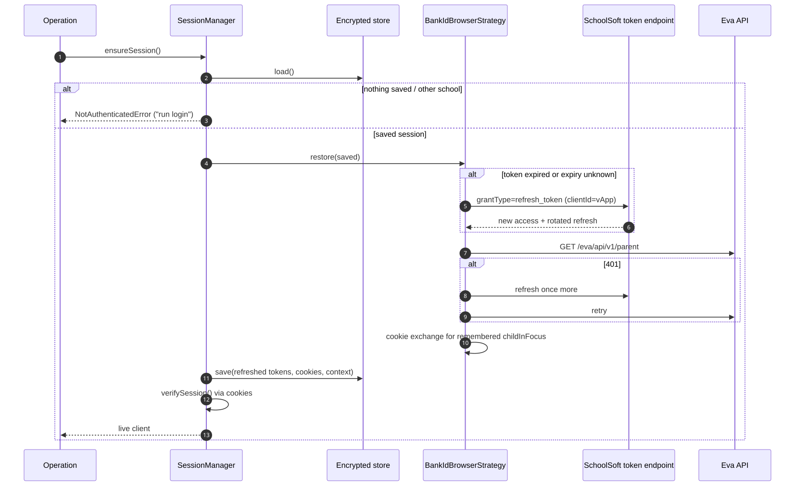

# Architecture

This document goes from the big picture down to the mechanics. If you only read one section, read [The shape of it](#the-shape-of-it). Diagrams are pre-rendered SVGs; click one to open its Mermaid source under [diagrams/src](diagrams/src/) (`make diagrams` re-renders them; see [diagrams/](diagrams/README.md)).

## The shape of it

One core, two surfaces, many hosts. The core knows SchoolSoft; the surfaces know how agents talk; the hosts are somebody else's software.

[](diagrams/src/system-overview.mmd)

Three rules keep this honest, and a script enforces them (`make boundaries`):

1. `src/core` never imports from an adapter and never reads `process.env`. It receives a `Config` object.
2. Adapters (`src/mcp`, `src/cli`, `src/shared`) import core only through `src/core/index.ts`.
3. Adapters never import each other. Common adapter code lives in `src/shared`.

## One definition per capability

Every capability is an **operation**: a name, a description with "Use when:" guidance, a Zod input schema, safety annotations, and a `run` function that returns plain data.

[](diagrams/src/operation-registry.mmd)

Adding an operation is one new file plus one line in the registry. The MCP tool, the CLI command and three reference documents appear without further work, and a boundary test refuses operations that lack annotations or a "Use when:" line.

## Login, step by step

SchoolSoft's guardian app uses OAuth 2 with PKCE. We use the same flow, with a local callback instead of the app's deep link. The one thing that took real effort to discover: SchoolSoft stamps the **user type** into the token from the OAuth **client id** (`vApp` = guardian app, `eApp` = student app), and resolves the actual user at request time. A guardian with a student-typed token fails every call with "Vi kunde inte hitta användaren".

[](diagrams/src/login-flow.mmd)

Two backends serve the data afterwards. The **Eva API** takes the Bearer token and serves profile, lunch, news and messages. The **webview REST** API takes the cookies, which are bound to one child (`childInFocus`), and serves schedule and assignments. Switching child means one more cookie exchange; the operations do that when `child_id` changes.

## Portal adapter: API first, browser where no API exists

Not everything a guardian sees has a JSON endpoint. Contact lists, subject rooms, bookings and shared files exist only as legacy web pages. Operations therefore talk to a **Portal**, one method per capability, and a static table (`PROVIDERS` in `src/core/portal/types.ts`) says which provider serves each one: the JSON APIs wherever they exist, a headless browser only where they don't. The routing is deterministic and documented; the browser is never used for something the API serves.

[](diagrams/src/portal-adapter.mmd)

The browser provider loads a page with the user's session cookies and runs a self-contained extractor inside it. Its session is read-only by construction: every non-GET request is aborted at the browser (an explicit allowlist exists for the rare read-only POST), and a navigation that lands on the login page or SchoolSoft's "log in again" gate throws a typed error instead of being followed. Playwright is an optional dependency, installed once with `schoolsoft-agent browser install`; the engine is bundled Chromium or, via `SCHOOLSOFT_BROWSER_ENGINE=cdp` and `SCHOOLSOFT_BROWSER_CDP`, any Chrome DevTools Protocol endpoint such as [Obscura](https://github.com/h4ckf0r0day/obscura). Write operations, when they come, use the same seam with writes explicitly allowed per call.

## Cold start, refresh and the one retry

Access tokens live 15 minutes. Every process start (an MCP server launching, a CLI command) goes through `ensureSession`:

[](diagrams/src/cold-start-refresh.mmd)

The retry exists because the alternative is a BankID round for the user. Refreshing when the expiry is _unknown_ protects sessions written by older versions.

## Session states

[](diagrams/src/session-states.mmd)

## Repository layout

```
src/core/         auth/, portal/ (types, api-portal, browser-portal, extractors, composite), browser/ (session, playwright, install), session/, operations/, config.ts, constants.ts, index.ts
src/mcp/          server.ts (registry → tools), respond.ts, index.ts (bin)
src/cli/          flags.ts, program.ts, exit-codes.ts, commands/{configure,doctor}.ts, index.ts (bin)
src/shared/       bootstrap.ts (env + config file → context), version.ts
src/http/         reserved for the remote transport (next spec)
skills/schoolsoft SKILL.md, scripts/schoolsoft.sh, references/commands.md (generated)
plugins/          claude/ (marketplace + two plugins), mcpb/, opencode/, openclaw/, hermes/, pi/
docs/             this file, schoolsoft-api.md, hosts/, reference/ (generated)
scripts/          check-boundaries, gen-docs, gen-skills, validate-plugins, e2e-login
test/             unit/, boundary/, functional/, packaging/, e2e/, helpers/
```

## Configuration

Precedence: CLI flags → `SCHOOLSOFT_*` environment → `config.json` → defaults.

| Key            | Env                        | Default                                  |
| -------------- | -------------------------- | ---------------------------------------- |
| `school`       | `SCHOOLSOFT_SCHOOL`        | required; `configure` finds it by name   |
| `orgId`        | `SCHOOLSOFT_ORGID`         | from the child's profile                 |
| `userType`     | `SCHOOLSOFT_USER_TYPE`     | `parent`                                 |
| `clientId`     | `SCHOOLSOFT_CLIENT_ID`     | `vApp` for parent, `eApp` otherwise      |
| `callbackPort` | `SCHOOLSOFT_CALLBACK_PORT` | `43117`                                  |
| `configDir`    | `SCHOOLSOFT_CONFIG_DIR`    | platform config dir (`doctor` prints it) |
| `stateDir`     | `SCHOOLSOFT_STATE_DIR`     | `<configDir>/state`                      |

## Testing

| Layer      | Where              | What it proves                                                                                                          | Network               |
| ---------- | ------------------ | ----------------------------------------------------------------------------------------------------------------------- | --------------------- |
| Unit       | `test/unit`        | OAuth, cookie exchange, guardian API paths, school ranking, session manager, strategy sequence, config, flag derivation | none (injected fetch) |
| Boundary   | `test/boundary`    | import rules, registry invariants, generated docs equal committed, doc links and diagrams                               | none                  |
| Functional | `test/functional`  | real MCP client over in-memory transport; CLI program in-process; one spawn of the built bin                            | none                  |
| Packaging  | `test/packaging`   | every host manifest validates; skill follows the Agent Skills spec; per-host skill builds                               | none                  |
| E2E        | `test/e2e` (gated) | the real thing: BankID once, then silent restore, forced refresh, every operation over stdio and CLI, child switching   | SchoolSoft            |

`make check` runs everything but E2E with coverage thresholds. `make e2e` runs the live suite; findings accumulate in a gitignored report.

## What lives where at runtime

| Path                            | Contents                                    | Sensitivity   |
| ------------------------------- | ------------------------------------------- | ------------- |
| `<configDir>/config.json`       | school slug, orgId                          | low           |
| `<configDir>/schools.json`      | cached public school list                   | none          |
| `<stateDir>/key.bin` (0600)     | AES key                                     | secret        |
| `<stateDir>/session.enc` (0600) | tokens, cookies, children's names/ids/class | personal data |

`schoolsoft-agent logout` removes the session; deleting the state directory removes everything.
