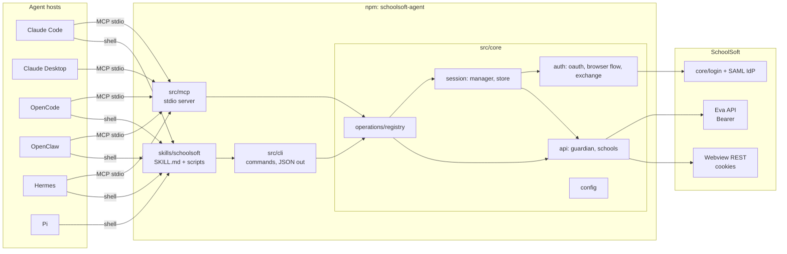

# schoolsoft-agent: two-surface foundation — design

Date: 2026-09-06. Status: approved in conversation, awaiting written review.

## 1. Purpose

Give AI agents seamless access to SchoolSoft for guardians, through two
interchangeable surfaces built on one core:

- an **MCP server** (stdio) for hosts that speak MCP, and
- a **CLI + skill** (agentskills.io `SKILL.md`) for hosts that run shell
  commands, including hosts with no MCP support (Pi).

The end user chooses the surface. Both are published from one npm package
and one git repository that also serves as the plugin marketplace.

This spec covers the *foundation* only. Two follow-on specs are planned:
**write operations** (absence reporting, messaging) and **remote transport +
deployment** (streamable HTTP, per-user storage, hosted BankID callback,
`make deploy`), which is what enables ChatGPT.

### Facts this design rests on (verified live, 2026-09-06, Täby)

- Guardian login = SchoolSoft's React login at `#/login/parent` with OAuth
  client id `vApp`. The client id, not the route, decides the token's
  `user_type` (eApp → STUDENT, vApp → PARENT). Localhost `redirect_uri` is
  accepted.
- Data comes from two backends: **Eva** (`/eva/api/v1|v2/...`, Bearer JWT)
  for profile/children, lunch, news, messages, calendar; and the **React
  webview REST** (`/rest-api/parent/...`, session cookies) for schedule and
  assignments. Cookies come from `/eva-apps/auth/login/parent` with
  `userId`, `orgId`, `childInFocus` headers and are bound to one child.
- Access tokens live 15 minutes; refresh works and rotates the refresh
  token. Refresh-token lifetime is unknown (tracked by the E2E snapshot).
- `@elias4044/ssp-node` is student-only; it stays only for HTTP helpers and
  as the token/cookie holder.
- Host research (same date): every local host except Pi supports stdio
  MCP; all read agentskills.io `SKILL.md`; ChatGPT needs a remote HTTPS MCP
  with OAuth 2.1 (out of scope here).

## 2. Decisions already made

| Question | Decision |
|---|---|
| ChatGPT / remote | Local-first now, remote-ready by layering; spec 3 |
| Packaging | One npm package `schoolsoft-agent`, layered directories |
| User choice | Two marketplace entries (`schoolsoft-mcp`, `schoolsoft-skill`), one package |
| Sharing logic | Operation registry; MCP tools, CLI commands and docs derived from it |
| Scope of this spec | Foundation + `find_school` + GitHub repo/CI + Makefile |
| Name | npm `schoolsoft-agent`; bins `schoolsoft-agent`, `schoolsoft-agent-mcp` |

## 3. Architecture



### 3.1 Repository layout

```
schoolsoft-agent/
  src/core/
    auth/        oauth.ts, browser-flow.ts, session-exchange.ts, bankid-browser.ts, strategy.ts
    api/         guardian.ts, schools.ts
    session/     session-manager.ts, store.ts, file-store.ts
    operations/  registry.ts, types.ts, <one file per operation>
    config.ts    typed Config + merge(fileConfig, overrides)
    index.ts     the ONLY import path adapters may use
  src/mcp/       server.ts (registry → registerTool), index.ts (stdio entry)
  src/cli/       program.ts (registry → commander), index.ts (bin entry), commands/{login,status,logout,configure,doctor}.ts
  src/http/      README.md only (reserved for spec 3)
  skills/schoolsoft/   SKILL.md, scripts/schoolsoft.sh, references/commands.md (generated)
  plugins/       per-host manifests (section 6)
  docs/          architecture.md, schoolsoft-api.md, hosts/*.md, reference/*.md (generated), superpowers/
  test/          unit/, boundary/, functional/, packaging/, e2e/
  scripts/       gen-docs.ts, gen-skills.ts, check-boundaries.ts
  Makefile, package.json, tsconfig*.json, .github/workflows/{ci,release}.yml
```

### 3.2 Core boundary rules

1. `src/core` never imports from `src/mcp`, `src/cli`, `src/http`, or
   `node:process`. Environment access lives only in adapters; core receives
   a `Config` object.
2. Adapters import core only via `src/core/index.ts`.
3. Core has no side effects at import time (no singletons created on load).
4. Every network call goes through an injectable `fetchImpl` so unit tests
   never touch the network.

Enforced by `scripts/check-boundaries.ts` (import graph walk) run in
`make check` and covered by `test/boundary/`.

### 3.3 Operation registry

```ts
interface Operation<I extends z.ZodObject<any>, O> {
  name: string;                 // surface-neutral, snake_case: get_schedule
  title: string;
  description: string;          // includes "Use when:" guidance
  input: I;                     // Zod object; MCP inputSchema and CLI flags derive from it
  annotations: { readOnly: boolean; destructive: boolean; idempotent: boolean; requiresAuth: boolean };
  run(ctx: OperationContext, args: z.infer<I>): Promise<O>;
}
interface OperationContext { manager: SessionManager; api: GuardianApi; config: Config; log: (msg: string) => void }
```

Registry contents for this spec (12): `find_school`, `list_children`,
`get_schedule`, `get_lunch_menu`, `get_assignments`,
`get_assignment_detail`, `get_news`, `get_messages`, `get_message`,
`login`, `auth_status`, `logout`. Auth operations are in the registry so
MCP and CLI expose them identically; `login` blocks until the browser
callback (5 min) and is marked `idempotent: false`.

Rules: names unique, descriptions non-empty, every operation has all four
annotation flags, `requiresAuth: false` only for `find_school` and
`auth_status`. A boundary test asserts these.

### 3.4 `find_school`

Input `{ query: string, limit?: number }`. Fetches
`https://sms.schoolsoft.se/internal/rest-api/login/schoollist` (public,
~3400 entries), caches it as JSON under the config dir for 24 h, and
returns `[{ name, slug, orgId, score }]` ranked by a diacritic-insensitive
substring/token match (no external fuzzy dependency). Used by `configure`
and available to agents so a user can say "Rösjöskolan" and get
`{ slug: "taby", orgId: 20 }`.

### 3.5 Configuration

File: `$XDG_CONFIG_HOME/schoolsoft-agent/config.json` (Linux),
`~/Library/Application Support/schoolsoft-agent/config.json` (macOS),
`%APPDATA%\schoolsoft-agent\config.json` (Windows). Keys: `school`,
`orgId`, `userType` (default `parent`), `clientId` (default by user type),
`callbackPort` (default 43117), `stateDir` (default: sibling `state/`).

Precedence: CLI flags > `SCHOOLSOFT_*` env (existing names) > file >
defaults. `schoolsoft-agent configure` writes the file interactively (uses
`find_school`). The MCP server never prompts; if `school` is missing it
returns a tool error naming `configure`.

Session state (encrypted tokens, cookies, guardian context) stays in the
existing `FileSessionStore` format under `stateDir`; migration from
`~/.schoolsoft-mcp` is a one-time move performed by `doctor --fix` and
documented.

## 4. Surfaces

### 4.1 MCP (`schoolsoft-agent-mcp`)

For each operation: `registerTool("schoolsoft_" + name, { title,
description, inputSchema: input.shape, annotations: {readOnlyHint,
destructiveHint, idempotentHint, openWorldHint: true} }, guarded(run))`.
Response helpers (`ok`/`fail`, 25 000-char cap, `structuredContent`) are
unchanged. `NotAuthenticatedError` text keeps pointing at
`schoolsoft_login`.

### 4.2 CLI (`schoolsoft-agent`)

- One subcommand per operation, kebab-case (`get-schedule`). Flags derived
  from the Zod schema: `ZodNumber`/`ZodString` → `--key <value>`,
  `ZodBoolean` → `--key`, `ZodEnum` → validated choice, optional → optional
  flag, `.describe()` → help text. Unsupported schema types fail the
  boundary test so they are caught at development time.
- Output: JSON on stdout (`--pretty` for indentation). Errors: one line on
  stderr. Exit codes: `0` ok, `1` error, `2` not authenticated, `3` not
  configured.
- Non-operation commands: `configure`, `doctor` (node version, config,
  session state, reachability of `sms.schoolsoft.se`, browser opener),
  `completion` (shell completion), `--version`.
- `login` prints the login URL to stderr as well as opening the browser,
  for sandboxed hosts.

### 4.3 Skill (`skills/schoolsoft`)

- `SKILL.md`: agentskills.io frontmatter (`name: schoolsoft`, `description`
  with when-to-use, `license: MIT`, `compatibility`), body < 200 lines:
  purpose; prerequisites (`node >= 22`, the package); workflow (run
  `status`; on exit 2 run `login` in the background and tell the user to
  complete BankID; on exit 3 run `configure`; ask which child when
  `list-children` returns more than one; answer in the user's language;
  never paste children's data outside the answer; write-op confirmation
  rule reserved); pointers to `references/commands.md`.
- `scripts/schoolsoft.sh`: resolves the binary in this order: `$SCHOOLSOFT_AGENT_BIN`,
  a sibling checkout (`../../dist/cli/index.js`), a global install, then
  `npx -y schoolsoft-agent`. Passes all args through.
- `references/commands.md`: generated by `make docs` from the registry
  (name, flags, exit codes, one example each). Drift test compares to the
  generator output.
- Per-host variants are produced by `make skills` into `dist/skills/<host>/`
  by merging `plugins/<host>/skill-metadata.json` into the frontmatter
  (`metadata.openclaw`, `metadata.hermes`, Claude Code extras). The source
  `SKILL.md` stays plain-spec so unlisted hosts work.

## 5. Makefile

Single entry point; `make help` lists targets with descriptions
(self-documenting via `##` comments).

| Target | Runs |
|---|---|
| `setup` | node version check, `npm ci` |
| `build` | `tsc` to `dist/` |
| `test` | unit + boundary + functional + packaging |
| `e2e` | live suite (`SCHOOLSOFT_E2E=1`), requires config |
| `check` | typecheck, lint, boundaries, test, coverage thresholds |
| `docs` | regenerate `docs/reference/*.md`, `skills/schoolsoft/references/commands.md` |
| `skills` | build per-host skill folders into `dist/skills/` |
| `mcpb` | build the Claude Desktop bundle |
| `plugin-validate` | `claude plugin validate`, `skills-ref validate`, manifest JSON schema checks |
| `login` / `status` / `logout` / `configure` / `doctor` | CLI passthroughs |
| `install-claude` / `install-opencode` / `install-hermes` / `install-openclaw` / `install-pi` | register this checkout with a local host |
| `release` | guarded by `check`; version bump, changelog, `npm publish`, git tag |

`deploy` is reserved for spec 3.

## 6. Host packaging

```
plugins/
  claude/.claude-plugin/marketplace.json
  claude/schoolsoft-mcp/{.claude-plugin/plugin.json, .mcp.json}
  claude/schoolsoft-skill/{.claude-plugin/plugin.json, skills/schoolsoft/}   (copied by `make skills`)
  mcpb/manifest.json
  opencode/{opencode.json, skill-metadata.json}
  openclaw/skill-metadata.json
  hermes/skill-metadata.json
  pi/pi.json   (merged into package.json "pi" key at build)
```

| Host | Surface(s) | Mechanism |
|---|---|---|
| Claude Code | MCP, skill | Marketplace in this repo: `/plugin marketplace add grimen/schoolsoft-agent`; `schoolsoft-mcp` runs `npx -y -p schoolsoft-agent schoolsoft-agent-mcp` with `userConfig` for school; `schoolsoft-skill` ships the skill |
| Claude Desktop | MCP | `.mcpb` from `plugins/mcpb/manifest.json` (`user_config.school`); directory submission later |
| OpenCode | MCP, skill | Documented `opencode.json` snippet; skill copied to `.agents/skills/` by `make install-opencode` |
| OpenClaw | skill, MCP | ClawHub publish with `metadata.openclaw`; native `mcp.servers` snippet documented |
| Hermes | skill, MCP | `hermes skills install github:grimen/schoolsoft-agent/skills/schoolsoft`; `mcp_servers` snippet documented |
| Pi | skill | `pi install git:github.com/grimen/schoolsoft-agent`; `package.json` `pi.skills` |

Sandbox note (documented per host): where the host cannot open a browser,
the agent shows the login URL printed by `login` to the user.

## 7. Documentation

- `README.md`: purpose, the two surfaces and how to choose, 60-second
  install per host, GDPR statement, disclaimer.
- `docs/architecture.md`: the component diagram above; sequence diagram of
  BankID login (browser → localhost callback → code exchange with vApp →
  parent profile → cookie exchange); sequence diagram of cold start
  (restore → refresh → 401 retry); state diagram of the session (none →
  tokens-only → established → expired); diagram of the registry fanning out
  to MCP tools, CLI commands, generated docs.
- `docs/schoolsoft-api.md`: endpoint catalogue with the guardian-vs-student
  findings, headers, and what 404s.
- `docs/hosts/<host>.md`: install, configure, sandbox caveats.
- `docs/reference/{tools,commands}.md`: generated.
- `CLAUDE.md` trimmed to project rules plus pointers into `docs/`.

## 8. Testing

| Layer | Location | Scope | Doubles |
|---|---|---|---|
| Unit | `test/unit` | oauth, exchange, guardian API, schools, session manager, strategy, config merge, flag derivation | injected fetch, memory store |
| Boundary | `test/boundary` | import rules; registry invariants; generated docs == committed | none |
| Functional MCP | `test/functional/mcp` | real MCP client over in-memory transport | fake GuardianApi |
| Functional CLI | `test/functional/cli` | program invoked in-process; exit codes; JSON shape; one spawn of the built bin | fake GuardianApi |
| Packaging | `test/packaging` | every manifest parses/validates; marketplace lists exactly two plugins; skill frontmatter per host | none |
| E2E (gated) | `test/e2e` | today's 14 live tests + the same operations via the CLI bin + `find_school` live | none |

Coverage (c8): `src/core` 100 % lines/branches, `src/mcp` and `src/cli`
90 %. Thresholds enforced in `make check`. E2E never runs in CI.

## 9. Repository and CI

- New public repo `grimen/schoolsoft-agent`; current history pushed as-is,
  then the restructure lands as commits on `main` via a PR from a worktree.
- `.github/workflows/ci.yml`: on push/PR, Node 24: `make check`,
  `make plugin-validate`, `make build`, `make skills`, `make mcpb`
  (artifacts uploaded).
- `.github/workflows/release.yml`: on `v*` tag: `make check` then
  `npm publish` with provenance, GitHub release with the `.mcpb` attached.
- Marketplace consumers read `plugins/claude/.claude-plugin/marketplace.json`
  from `main`; plugin entries pin the npm version.

## 10. Migration from today's code

Mechanical moves: `src/services/*` → `src/core/session/`, `src/auth/*` →
`src/core/auth/`, `src/api/*` → `src/core/api/`, `src/tools/*` become
operations, `src/index.ts` → `src/mcp/index.ts`. `wiring.ts` splits into
`core/config.ts` (pure) and adapter bootstraps. Existing tests move with
their modules; the functional MCP test becomes registry-driven.

## 11. Out of scope (later specs)

Write operations; remote HTTP transport, multi-user storage, hosted BankID
callback, ChatGPT listing, `make deploy`; Claude Desktop directory
submission; localisation of tool descriptions.

## 12. Risks

- **SchoolSoft changes** its unofficial API: mitigated by the endpoint
  catalogue, the live E2E suite, and the injected-fetch strategy test that
  documents the exact sequence.
- **Terms of service**: unofficial access; the README states it and the
  project stays non-commercial until clarified.
- **Refresh-token lifetime** unknown: the E2E snapshot answers it over
  time; worst case users re-run `login` periodically.
